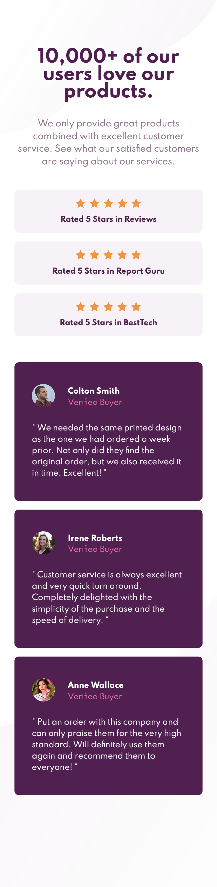
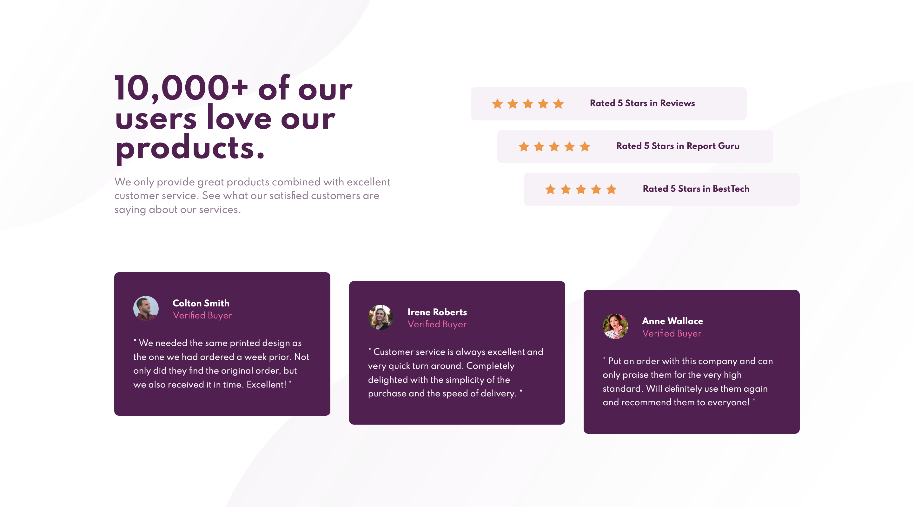

# Frontend Mentor - Social proof section solution

This is a solution to the [Social proof section challenge on Frontend Mentor](https://www.frontendmentor.io/challenges/social-proof-section-6e0qTv_bA). Frontend Mentor challenges help you improve your coding skills by building realistic projects. 

## Table of contents

- [Overview](#overview)
  - [The challenge](#the-challenge)
  - [Screenshot](#screenshot)
  - [Links](#links)
- [My process](#my-process)
  - [Built with](#built-with)
  - [What I learned](#what-i-learned)
- [Author](#author)


**Note: Delete this note and update the table of contents based on what sections you keep.**

## Overview

### The challenge

Users should be able to:

- View the optimal layout for the section depending on their device's screen size

### Screenshot




### Links

- Solution URL: [Github](https://github.com/erelita/social-proof-section.git)
- Live Site URL: [Github Pages](https://erelita.github.io/social-proof-section/)

## My process

### Built with

- Semantic HTML5 markup
- CSS custom properties
- Flexbox
- Mobile-first workflow

### What I learned

I used a section element as the main container since this is just a part/section and I think it's easier to add this to a project (if there's a whole challenge with this on it) if it's already in a section  element.

```html
<section class="social-proof">
</section>
```

I learned to used two background images on this project. I encountered a problem with the right bottom positioning of the bottom image and gald I found how to fixed it with "fixed" as background-attachment.

```css
body {
    background: url(../images/bg-pattern-top-mobile.svg) left top, url(../images/bg-pattern-bottom-mobile.svg) right bottom;
    background-repeat: no-repeat, no-repeat;
    background-attachment: scroll, fixed;
}
```

I also tried using BEM. I watched a video of Kevin Powell and he mentioned it, and as a curious cat, I searched more about it. It's very effective in my opinion because someone else can read the css code and not be confused on what's selector/s is/are inside an element/selector/s or if it's just a styling an element.

I added classes in the h2 and p elements because I think it's more cleaner in the css and can be easier to udnerstand.

```css
/* ----- INTRO */
.intro {
    text-align: center;
    margin-bottom: 2.5em;
}

.intro__heading {
    color: var(--clr-primary-600);
    font-size: 2em;
    line-height: 1em;
    margin-bottom: 0.95em;
}

.intro__desc {
    color: var(--clr-neutral-400);
    font-size: 0.97em;
    line-height: 1.5em;
}
```

My past challenges wasn't so responsive (or not at all), so I focused on this project's reponsiveness using CSS Flexbox only. It took me longer than usual, but I'm glad I did because I learned a lot about flexbox.

## Author

- Github - [Erelita](https://github.com/erelita)
- Frontend Mentor - [@erelita](https://www.frontendmentor.io/profile/erelita)
